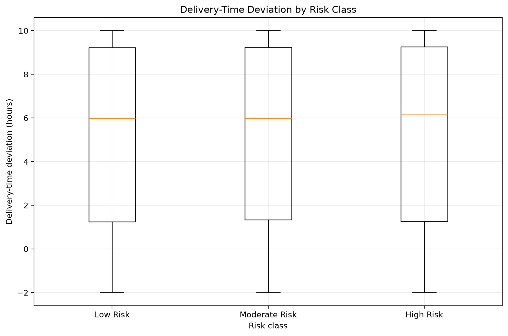
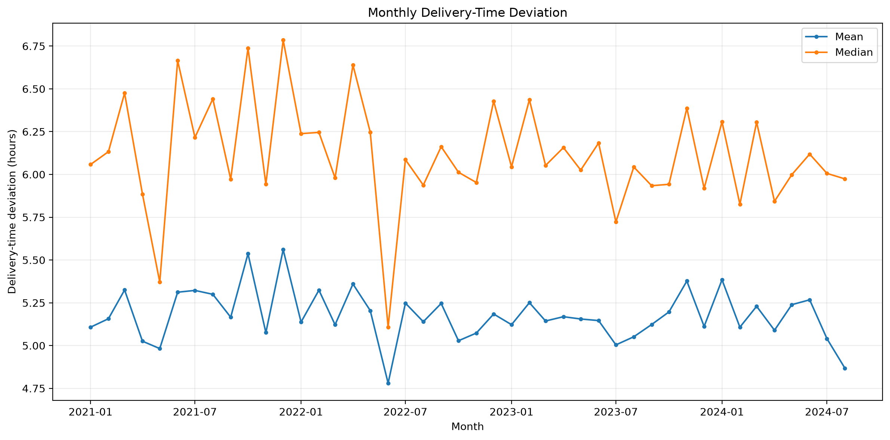
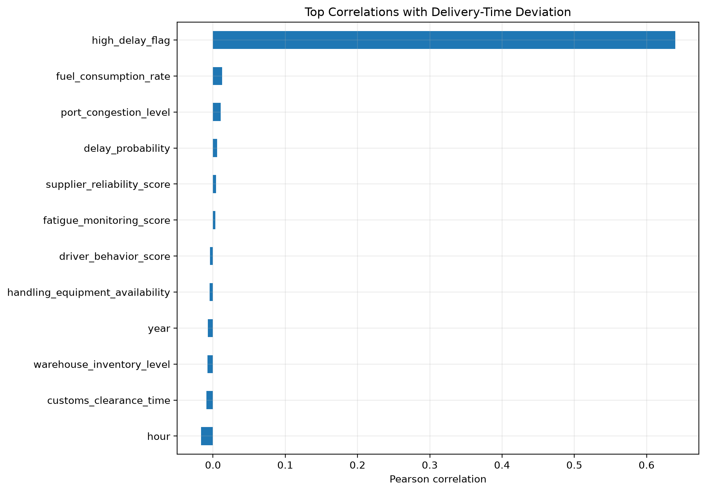
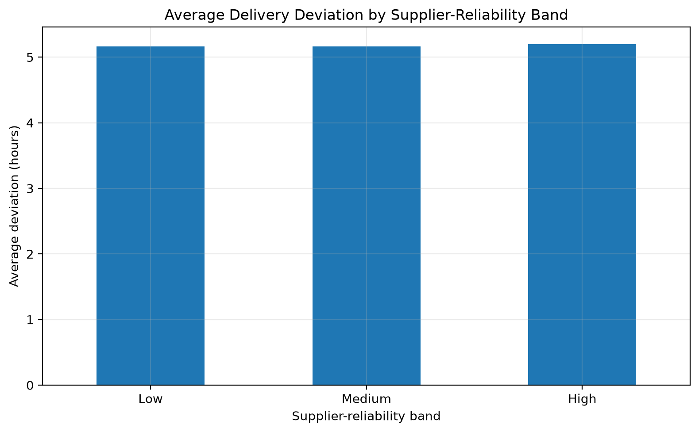
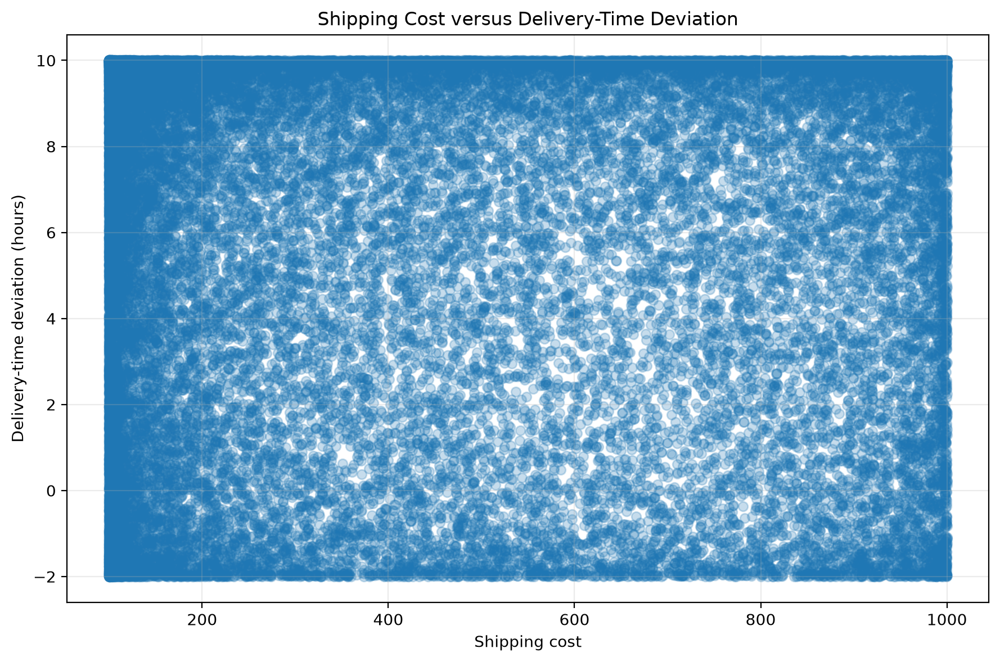
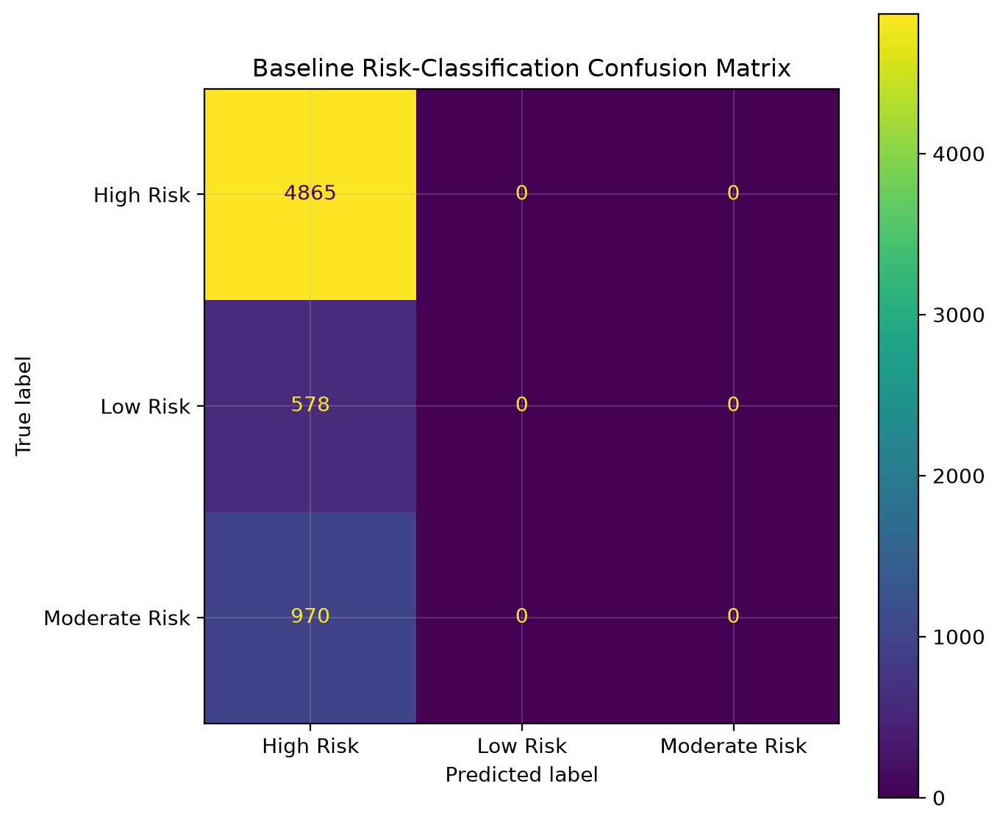

# 🚚 Supply Chain Logistics Performance Analysis


> **End-to-end Python analysis of logistics performance, delivery-time deviation, operational risk, and predictive modelling.**

📓 **[View the Full Jupyter Notebook](./Supply_Chain_Logistics_Analysis_Portfolio.ipynb)**

---

## 📌 Project Overview

This project analyses **32,065 hourly logistics observations** recorded between **January 2021 and August 2024**.

The project covers the complete data-analysis workflow:

- 🔎 Data validation and quality assessment
- 🧹 Data cleaning and standardisation
- 🛠️ Feature engineering
- 📊 Exploratory data analysis
- 🚛 Logistics and operational risk analysis
- 🔗 Correlation analysis
- 🤖 Predictive modelling
- 💡 Business interpretation and recommendations

A key conclusion of the project is that a dataset can be technically clean while still lacking sufficient predictive signal for reliable operational decision-making.

---

## 🎯 Business Problem

Logistics teams need to understand which factors are associated with delivery disruption so they can identify bottlenecks, prioritise monitoring, and improve service performance.

### Main Question

> **Which operational, environmental, warehouse, and transportation factors are associated with delivery-time deviation and logistics risk?**

The analysis also investigates:

- How delivery-time deviation changes over time
- Whether the supplied risk classes represent different delivery outcomes
- Whether supplier reliability is associated with delivery performance
- Whether higher shipping cost is associated with lower delivery deviation
- Which variables have the strongest relationship with delivery deviation
- Whether logistics risk can be predicted without introducing target leakage

---

## 🗂️ Dataset

**Source:** [Dynamic Supply Chain Logistics Dataset on Kaggle](https://www.kaggle.com/datasets/datasetengineer/logistics-and-supply-chain-dataset/versions/1)

| Attribute | Value |
|---|---|
| 📄 Licence | CC0 — Public Domain |
| 📦 Records | 32,065 |
| 🧩 Source columns | 26 |
| 📅 Time period | 2021-01-01 to 2024-08-29 |
| ⏱️ Granularity | Hourly observations |
| 💾 Source file | `dynamic_supply_chain_logistics_dataset.csv` |

The dataset includes variables related to:

- Vehicle location and fuel consumption
- ETA variation and traffic congestion
- Warehouse inventory and loading time
- Handling-equipment availability
- Weather and port congestion
- Shipping cost and supplier reliability
- Lead time and historical demand
- IoT monitoring and cargo condition
- Route risk and customs clearance
- Driver behaviour and fatigue
- Disruption likelihood and delay probability
- Risk classification
- Delivery-time deviation

---

## 🧰 Tools & Technologies

| Tool | Purpose |
|---|---|
| 🐍 **Python** | Core analysis |
| 🐼 **pandas** | Data manipulation and cleaning |
| 🔢 **NumPy** | Numerical analysis |
| 📊 **Matplotlib** | Data visualisation |
| 🤖 **scikit-learn** | Predictive modelling |
| 📓 **Jupyter Notebook** | Interactive analysis and documentation |

---

## 🔄 Analysis Workflow

### 1. 🔍 Data Validation

The expected dataset schema was validated before analysis to confirm that all required variables were present.

### 2. 🧪 Data Quality Assessment

The dataset was reviewed for:

- Missing values
- Duplicate records
- Data types
- Category consistency
- Numeric ranges
- Unusual or potentially invalid observations

### 3. 🧹 Data Cleaning

The cleaning process included:

- Standardising column names
- Converting timestamps to datetime
- Converting numeric fields to appropriate data types
- Standardising risk categories
- Checking duplicate records
- Sorting observations chronologically

No records were removed because the dataset contained no missing values or exact duplicates.

### 4. 🛠️ Feature Engineering

Additional analytical features were created for:

- Year
- Month
- Day of week
- Hour
- Weekend indicator
- High-delay observations
- Supplier-reliability bands
- Shipping-cost bands

The high-delay flag was defined using the **75th percentile of delivery-time deviation**. It therefore represents a relative analytical threshold rather than an operational SLA.

### 5. 📊 Exploratory Data Analysis

The analysis examined:

- Delivery-time deviation over time
- Risk-class distribution
- Delivery deviation by risk class
- Weekday patterns
- Supplier-reliability groups
- Shipping-cost groups
- Relationships between operational variables and delivery deviation

### 6. 🤖 Predictive Modelling

A **Random Forest classifier** was created as a baseline model for predicting logistics risk.

A chronological train-test split was used to respect the time-ordered nature of the dataset.

Potential target-leakage variables were excluded before training.

---

## 📈 Key Results

| KPI | Result |
|---|---:|
| 📦 Total observations | **32,065** |
| ❓ Missing values | **0** |
| 📑 Exact duplicate rows | **0** |
| ⏱️ Average delivery deviation | **5.18 hours** |
| 📍 Median delivery deviation | **6.11 hours** |
| 📈 90th-percentile delivery deviation | **9.92 hours** |
| 🚚 Average lead time | **5.23 days** |
| ⚠️ High-risk observations | **74.67%** |
| 🔴 Relative high-delay observations | **25.00%** |

---

# 🔎 Key Findings

## 1. ⚠️ Risk Classification Does Not Clearly Distinguish Delivery Performance

Average delivery-time deviation was:

| Risk Class | Average Deviation |
|---|---:|
| 🟢 Low Risk | 5.12 hours |
| 🟠 Moderate Risk | 5.18 hours |
| 🔴 High Risk | 5.18 hours |

The distributions overlap substantially.

This indicates that the supplied risk classification should **not automatically be interpreted as delivery-delay severity** without first understanding how the target was defined.



---

## 2. 📅 Delivery Performance Remains Relatively Stable Over Time

Monthly average delivery-time deviation remains relatively stable throughout the analysed period.

There is no clear long-term upward or downward trend, suggesting that calendar month alone is unlikely to explain delivery performance.



---

## 3. 🔗 No Original Numeric Variable Shows a Strong Linear Relationship With Delivery Deviation

The strongest apparent correlation belongs to `high_delay_flag`, but this variable is derived directly from `delivery_time_deviation` and is therefore not an independent explanatory factor.

The original operational variables show correlations close to zero.

The available data therefore does not provide evidence that any single measured factor — such as congestion, weather, supplier reliability, route risk, customs time, or shipping cost — independently explains delivery deviation.



---

## 4. 🏭 Supplier Reliability Does Not Materially Separate Delivery Outcomes

Average delivery deviation remains around **5.2 hours** across Low, Medium, and High supplier-reliability groups.

The differences are too small to support the conclusion that higher supplier reliability leads to lower delivery deviation in this dataset.



---

## 5. 💰 Higher Shipping Cost Is Not Associated With Better Delivery Performance

Average delivery deviation is nearly identical across shipping-cost quartiles.

The available data therefore does not support the conclusion that higher transportation expenditure results in better delivery performance.



---

# 🤖 Predictive Model

A **Random Forest classifier** was trained to predict:

- 🟢 Low Risk
- 🟠 Moderate Risk
- 🔴 High Risk

The following variables were excluded because they could introduce target leakage:

- `delay_probability`
- `disruption_likelihood_score`
- `delivery_time_deviation`
- `high_delay_flag`

## 📊 Model Performance

| Metric | Result |
|---|---:|
| Accuracy | **0.76** |
| High Risk recall | **1.00** |
| Moderate Risk recall | **0.00** |
| Low Risk recall | **0.00** |
| Macro F1 | **0.29** |

Although the model achieves **76% accuracy**, it predicts every observation in the test set as **High Risk**.

Because High Risk already represents approximately 75% of the observations, the accuracy is misleading.

The model therefore has **no useful ability to identify Low or Moderate Risk observations**.



### 🧠 Model Interpretation

The baseline model should **not be used operationally**.

The result demonstrates why classification models should not be evaluated using accuracy alone, particularly when the target variable is highly imbalanced.

More appropriate evaluation should consider:

- Precision
- Recall
- F1 score
- Balanced accuracy
- Minority-class performance
- Target definition
- Feature relevance
- Data leakage

---

# 💡 Business Recommendations

### 1. 🎯 Validate the Risk Definition

Confirm how the following variables were generated and what operational events they represent:

- `risk_classification`
- `delay_probability`
- `disruption_likelihood_score`

Without a clear business definition, model performance cannot be interpreted reliably.

### 2. ⏱️ Define Operational Delay Thresholds

The current high-delay definition is based on the dataset's 75th percentile.

For real operational use, this should be replaced by business-approved thresholds such as:

- Acceptable delivery deviation
- SLA limits
- Delay-severity categories
- Customer-service targets

### 3. 🚚 Collect More Detailed Shipment-Level Data

Future analysis would benefit from additional variables such as:

- Shipment or order ID
- Carrier
- Route
- Origin and destination
- Distance
- Service level
- Planned dispatch time
- Actual dispatch time
- Expected delivery time
- Actual delivery time
- Ordered quantity
- Delivered quantity

These fields would allow more meaningful analysis of routes, carriers, lead times, and OTIF performance.

### 4. 📐 Improve Model Evaluation

Future models should be compared against simple baselines and evaluated using:

- Macro F1
- Balanced accuracy
- Precision and recall by class
- Time-based validation
- Confusion matrices

### 5. 🛑 Avoid Operational Deployment of the Current Model

The current model does not provide enough predictive value for operational use.

Further modelling should continue only after confirming the target definition and identifying predictors that contain measurable signal.

---

# ⚠️ Limitations

- The dataset may be synthetic or simulated.
- Units and status definitions are not fully documented.
- Several status-related variables contain continuous values.
- No shipment identifier is available for conventional order-level analysis.
- Carrier, route, service-level, and milestone information is unavailable.
- The high-delay threshold is dataset-relative and does not represent an SLA.
- Correlation measures association and does not establish causality.
- Aggregate analysis may hide relationships within individual routes, carriers, or shipment types.
- The predictive target is highly imbalanced.

---

# 🚀 Future Work

Potential extensions of this project include:

- 🗃️ Build a formal data dictionary
- 🗺️ Perform GPS and geospatial analysis
- 🔬 Explore non-linear relationships
- 🔗 Analyse feature interactions
- 📦 Segment observations into operational profiles
- 🤖 Compare Logistic Regression and other baseline models
- ⏳ Apply time-based cross-validation
- ⚖️ Investigate class-imbalance strategies
- 📊 Develop an interactive Power BI or Streamlit dashboard

---

# 📁 Repository Structure

```text
Supply-Chain-Logistics-Analysis/
│
├── 📄 README.md
├── 📓 Supply_Chain_Logistics_Analysis_Portfolio.ipynb
├── 📦 requirements.txt
│
├── 📁 data/
│   ├── .gitkeep
│   └── processed/
│
└── 📁 reports/
    └── figures/
        ├── baseline_confusion_matrix.png
        ├── delay_by_supplier_reliability.png
        ├── delay_by_weekday.png
        ├── delivery_deviation_by_risk.png
        ├── delivery_deviation_correlations.png
        ├── monthly_delivery_deviation.png
        ├── risk_class_distribution.png
        └── shipping_cost_vs_delay.png
